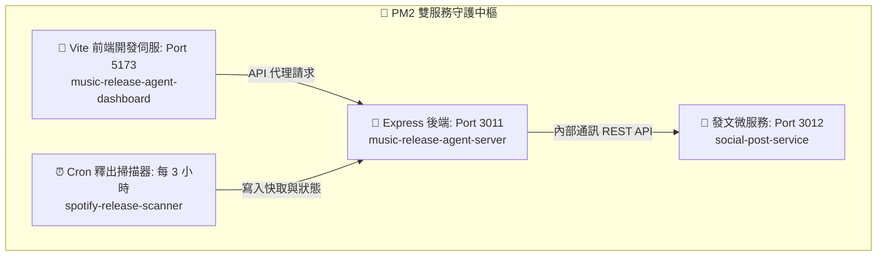

# 🐶 PM2 雙服務背景永動小精靈運行指南

為了讓我們的「音樂釋出掃描器」與「社群自動發文微服務」能在背景 24 小時安穩運行，即使關閉 Terminal 視窗也不會中斷，本專案已完整整合 **PM2 進程守護機制**。

---

## 🏛️ 微服務架構背景進程設計

透過一個 PM2 設定檔，我們能同時管理四個核心背景任務：



---

## 🚀 快速啟動與管理指令

專案根目錄下已備有 `ecosystem.config.cjs`。在 Terminal 中輸入以下指令即可輕鬆掌管一切：

### 1. 一鍵啟動所有背景服務
```bash
# 在專案根目錄執行即可一鍵啟動後端、前端、掃描器與發文微服務
npx pm2 start ecosystem.config.cjs
```

### 2. 🔍 查看運行中的服務狀態
```bash
npx pm2 list
```

### 3. 🪵 即時查看運行日誌
PM2 會自動幫您收集各服務的標準輸出與錯誤日誌，並保存在 `logs/` 目錄中：
```bash
# 查看所有服務的即時日誌（按 Ctrl + C 可隨時退出監聽）
npx pm2 logs

# 僅查看特定服務的日誌
npx pm2 logs music-release-agent-server
npx pm2 logs social-post-service
```

### 4. 🔄 重啟與暫停服務
當您修改了 `.env` 變數、程式碼有重大變更，或想暫時釋放 Port 埠號時：
```bash
# 重啟特定服務
npx pm2 restart social-post-service

# 重啟所有服務
npx pm2 restart all

# 暫停特定服務（例如暫時關閉發文服務以釋放 Port 3012）
npx pm2 stop social-post-service

# 停止並刪除 PM2 列表中的所有託管進程
npx pm2 delete all
```

---

## 💡 進程守護的優勢（面試必聊加分點）

1. **Autorestart (自動拉起)**：當 `music-release-agent-server` 遭遇 Spotify/Gemini API 限流 (429) 或未捕獲的例外崩潰時，PM2 能夠在 **1 毫秒內主動重啟** 進程，保證展示期間服務絕不斷線。
2. **Cron restart (定時調度)**：音樂掃描器 `spotify-release-scanner` 採用 `autorestart: false` 並設定每 3 小時觸發的 `cron_restart`。這確保了定時任務的穩定運行，同時不會在執行完畢後進入無窮重啟迴圈。
3. **Cwd (跨倉庫定位)**：PM2 設定檔中利用 `cwd` 屬性，成功將相鄰目錄中的 `social-post-service` 與子目錄 `dashboard` 串接在一起，展示了對多進程與多倉庫（Multi-repo）的統一排程控制能力。
