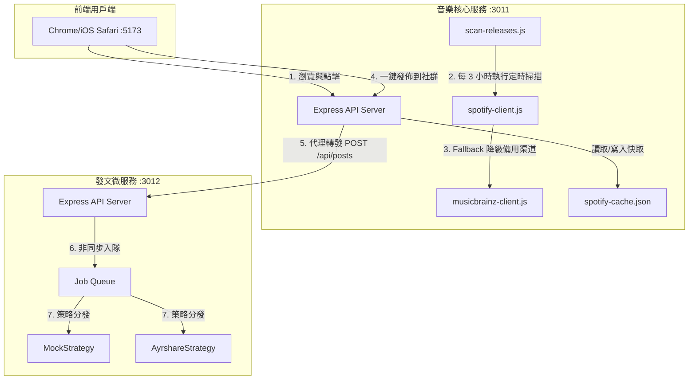
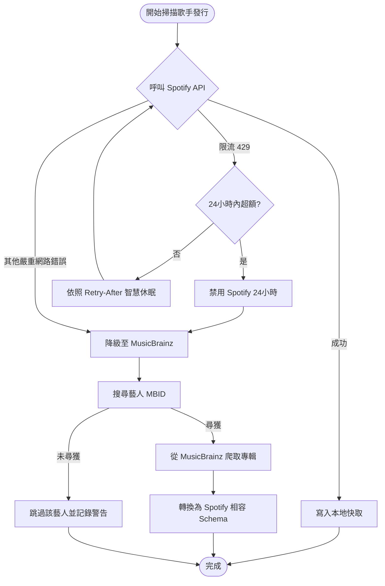

# 🎵 Music Release Agent & AI Review Center

[](./coverage-badge.svg)
[](./PM2_DAEMON_GUIDE.md)
[](https://opensource.org/licenses/MIT)

`music-release-agent` 是一個自動化音樂內容系統：追蹤新發行、生成 AI 樂評、輸出 GitBook 內容，並透過 companion service 處理非同步社群發文。

這個 repo 的重點不是單一 UI 或單一 API，而是三件事一起成立：

- 可重現的 dry-run 驗證路徑
- 明確的核心服務 / 發文服務邊界
- 對外部依賴失敗的可驗證降級行為

快速導覽：

- [Demo Walkthrough Artifact](./docs/demo_walkthrough_artifact.md)
- [Readiness And Observability Guide](./docs/readiness_and_observability.md)

---

## Evaluator Quickstart

如果你只想在 3 分鐘內確認這個 repo 值不值得繼續深看，先跑：

```bash
npm install
npm run demo:verify
```

這條路徑：

- 使用內建 `data/mock-releases.json` 執行離線掃描
- 驗證 `data/mock-gitbook/` 內的關鍵 Markdown 產物
- 驗證 `SUMMARY.md` 是否正確串接新發行頁面
- 不需要 Spotify、Gemini 或 GitHub 憑證

**預期結果：**

- console 顯示 `demo:verify passed`
- `data/mock-gitbook/SUMMARY.md` 包含 3 份模擬樂評
- `data/mock-gitbook/new-releases/` 包含對應 Markdown 檔案

## Verification Modes

### 1. Repo-only proof

```bash
npm run demo:verify
```

驗證離線掃描、內容生成與 mock GitBook 輸出。

### 2. Cross-service proof

```bash
npm run demo:verify:social
```

暫時拉起 `music-release-agent` 與 `social-post-service`，驗證：

- `music-release-agent` 代理轉發 `POST /api/social/publish`
- `social-post-service` 回傳 `202 Accepted`
- 任務可透過 `GET /api/social/status/:jobId` 查到並完成

### 3. Failure-mode proof

```bash
npm run demo:verify:social:down
```

驗證 `social-post-service` 不可達時：

- `/api/social/health` 會回報 `reachable: false`
- `/api/social/publish` 會穩定回 `502`
- `/readyz` 會顯示 `degraded`
- 核心服務不會崩掉

---

## Full Demo Path

如果你要展示完整雙服務體驗，再安裝 companion service 與 dashboard：

```bash
# 安裝後端與發文微服務依賴
npm install
cd ../social-post-service && npm install && cd ../music-release-agent

# 安裝前端 Dashboard 依賴
cd dashboard && npm install && cd ..
```

然後啟動：

```bash
npx pm2 start ecosystem.config.cjs
```

*(詳細指令與除錯方式請參考：[🐶 PM2 守護進程指南](./PM2_DAEMON_GUIDE.md))*

打開 [http://localhost:5173](http://localhost:5173)：

- 音樂庫瀏覽
- AI 雙語歌詞
- 社群自動發佈

若你只想單獨執行離線模擬，也可以跑：

```bash
npm run scan:dry
```

### Dashboard 體驗
打開瀏覽器訪問 [http://localhost:5173](http://localhost:5173) 即可立即開始體驗：
- 🌟 **音樂庫瀏覽**：流暢的毛玻璃卡片式導覽與最新發行清單。
- 🔮 **AI 雙語歌詞**：點選任一曲目，即時獲取 Gemini 翻譯與賞析對照。
- 🚀 **社群自動發佈**：點擊「發佈到社群」一鍵觸發非同步多平台發佈流。

### `social-post-service` 何時必須存在？

`social-post-service` **不是**離線驗證必需品。

不需要 `social-post-service` 的功能：

- `npm run demo:verify`
- `npm run scan:dry`
- 本地檢查 GitBook mock 輸出

需要 `social-post-service` 的功能：

- Dashboard 內「發佈到社群」按鈕
- 端到端驗證非同步發文流程
- PM2 啟動的完整雙服務演示
- `npm run demo:verify:social`

可在 `social-post-service` 未啟動時驗證的 failure-mode：

- `npm run demo:verify:social:down`

如果 `SOCIAL_SERVICE_URL` 指向的服務未啟動，核心 repo 的離線 dry-run 與大部分閱讀/展示流程仍然成立，但社群發佈路徑不成立。

## Runtime Signals

對外可用的 runtime 端點：

- `GET /healthz`
  - liveness probe
  - 只回答服務是否活著
- `GET /readyz`
  - readiness probe
  - 回傳 core readiness 與 dependency state
- `GET /api/social/health`
  - companion service reachability

`/readyz` 的設計原則：

- `status: ok`
  - 核心服務 ready，companion service 可達
- `status: degraded`
  - 核心服務 ready，但 `social-post-service` 不可達
- `status: not_ready`
  - 連核心靜態資產或必要 mock data 都不完整

---

## 📐 雙服務微服務架構 (Microservices Architecture)

本專案遵循**單一職責原則 (SRP)**，將高頻讀取的音樂儀表板與高防禦要求的寫入型社群發文拆分為獨立微服務：



---

## 🛡️ 容災與降級設計 (Resiliency & Failover Flow)

外部三方 API 的不穩定性與速率限制（Rate Limits）是生產環境最棘手的考驗。為此，我們在 Spotify API 通訊層設計了 **「雙源容災降級機制」**：

1. **智慧限流熔斷**：當遇到 `HTTP 429` 限流時，自動解析 `Retry-After` 智慧休眠。若 24 小時內觸發限流次數達 2 次，則啟動熔斷禁用 Spotify API 24 小時，保護開發者憑證。
2. **MusicBrainz 降級渠道**：一旦 Spotify API 被禁用或連線失敗，掃描器自動切換為公開的 **MusicBrainz API**，藉由搜尋藝人 MBID 爬取專輯列表，並動態轉換為與 Spotify 相容的 Schema，確保發行管線永不斷線。



---

## 🎨 前端效能調優與安全實踐

1. **背景非同步預渲染 (iOS Web Share API)**：iOS (WebKit) 的 `navigator.share` 要求必須在用戶點擊的瞬間**同步呼叫**。任何非同步的 `await` 畫布轉換都會導致 user gesture 失效。Dashboard 在用戶點選歌曲的當下，即於背景非同步將分享卡片渲染為 File 物件，確保用戶按下的瞬間能 100% 同步觸發 iOS 原生分享對話框。
2. **`canvas.toBlob` 記憶體優化**：捨棄傳統將畫布轉成巨大 Base64 字串再 fetch 轉 Blob 的做法，直接使用原生的 `canvas.toBlob` Promise 包裝，在瀏覽器底層輸出二進位圖片檔，降低了 **33% 的記憶體空間佔用**，防止行動端瀏覽器因 OOM (記憶體溢出) 卡頓或重啟。
3. **安全的輕量 Markdown 轉譯器**：在將 AI 歌詞（包含 Markdown 語法）渲染至前端時，先對特殊 HTML 字元進行轉義（Escape），杜絕 XSS（跨網站指令碼）腳本注入安全風險，再藉由狀態化逐行解析器輸出符合標準語意的 HTML。

---

## 🧪 單元測試與程式碼覆蓋率

本專案實施嚴格的防禦性測試，後端核心模組（服務類別、策略模式實作與掃描協調器）之語句覆蓋率均達到 **80% - 100%**。

```bash
# 執行所有 21 個單元與基準防禦測試
npm run test

# 執行測試並產生覆蓋率報告，同時動態更新 Coverage Badge
npm run test:coverage
```

---

## ⚙️ 生產環境變數配置

若要運行真實的 Spotify 聯網掃描與 Gemini AI 生成流程，請參閱 [.env.example](./.env.example) 建立您的 `.env` 檔案，填入以下金鑰：

```ini
GEMINI_API_KEY=your_gemini_api_key_here
SPOTIFY_CLIENT_ID=your_spotify_client_id_here
SPOTIFY_CLIENT_SECRET=your_spotify_client_secret_here
REVIEWS_PATH=./data/mock-gitbook
GITBOOK_PATH=../social-dancing-notes
SOCIAL_SERVICE_URL=http://localhost:3012
```

### 執行真實掃描與 GitOps 發布
```bash
# 1. 授權登入獲取 Spotify Token
npm start ➡️ 瀏覽器訪問 http://localhost:3011/login/spotify

# 2. 執行真實掃描管線（分析新歌、AI起草、自動 Commit/Push 寫入 GitBook）
npm run scan
```
