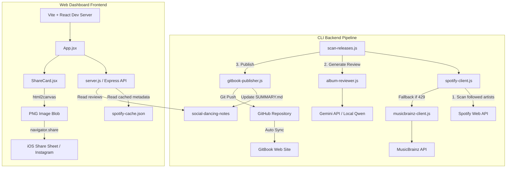
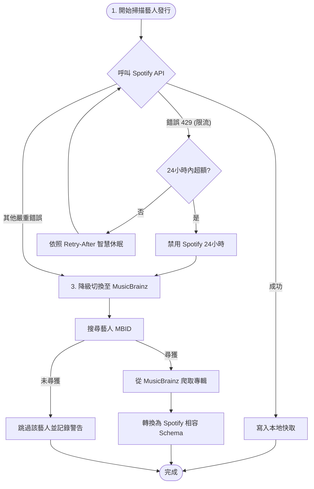

# 🏠 Music Release Agent & AI Review Center


`music-release-agent` 是一個串接 Spotify API、Gemini AI 與 GitBook GitOps 發布流的自動化新歌掃描與樂評推播系統。
專案同時包含一個採用 **Vite + React (TailwindCSS)** 打造的高質感前端 Dashboard，支援行動端 Web Share API，能預先非同步在背景渲染出 9:16 比例的社群分享圖卡（Instagram Stories / TikTok Reels），並提供原生分享對話框。

---

## 🚀 3 分鐘零配置快速體驗 (離線模擬模式)

為了方便面試官與開發者在**不設定任何外部 API 金鑰（Spotify / Gemini）與帳號授權**的情況下快速驗證系統，本專案內建了 **Dry Run 離線模擬管線**。

### 1. 安裝依賴項
```bash
npm install
cd dashboard && npm install && cd ..
```

### 2. 啟動模擬掃描管線 (模擬一鍵發佈流)
執行以下指令，系統會讀取預置的模擬音樂發行資料，模擬掃描、AI 樂評起草、目錄更新與 GitOps 推送流程：
```bash
npm run scan:dry
```
*模擬產出的 Markdown 文件與目錄將會寫入本地的 `data/mock-gitbook/` 中，供您直接檢驗。*

### 3. 啟動前端 Dashboard
在專案根目錄執行：
```bash
# 啟動後端 Express API 伺服器
npm start
```
另開一個終端機視窗，啟動前端開發伺服器：
```bash
cd dashboard
npm run dev -- --host
```
開啟瀏覽器訪問 `http://localhost:5173`，即可在 Dashboard 中體驗流暢的音樂庫導覽、AI 歌詞翻譯賞析，以及導出 IG 分享卡！

---

## 📐 系統架構圖 (System Architecture)

本系統由 **CLI 掃描與發布管線 (Backend Pipeline)** 以及 **視覺化控制台 (Web Dashboard)** 兩大部分組成。其拓撲關係如下：



---

## 🛡️ 容災與降級設計 (Resiliency & Failover Flow)

外部 API 的不穩定性與速率限制（Rate Limits）是生產環境中最棘手的難題。為了確保系統的高可用性與彈性，我們在 Spotify API 的通訊層設計了 **「雙源容災降級機制」**：

1. **限流熔斷機制**：當 Spotify API 遇到 `HTTP 429 (Too Many Requests)` 時，自動讀取 `Retry-After` 標頭進行休眠。若 24 小時內觸發大於等於 2 次，會觸發 24 小時強制冷卻，保護帳號。
2. **MusicBrainz 降級備用渠道**：當 Spotify 遭限流或不可用時，掃描器會無縫切換至公開的 **MusicBrainz** API。藉由搜尋藝人 MBID，自動將發行資料拉回並解析為相容的 schema，確保掃描管線永不斷線。



---

## 🎨 前端效能調優與安全性設計 (Performance & Security)

在 Web Dashboard 的設計上，我們實現了符合生產水準的架構設計：

### 1. 繞過 iOS 觸發限制的「背景非同步預生成」
iOS (WebKit) 的 `navigator.share` 要求必須在**用戶點擊的瞬間同步呼叫**。任何非同步的 `await`（如等待畫布渲染、等待圖片下載）都會導致 user gesture 失效而報錯。
- **作法**：當用戶選擇專輯或歌詞更新時，`App.jsx` 會透過 `useCallback` 包裝的 `generateShareFile` 在**背景非同步預先將圖卡渲染成 File 物件**並暫存於 State。當用戶點選「分享」時，即可** 100% 同步**呼叫 `navigator.share`，實現完美的 iOS 原生分享體驗。

### 2. `useCallback` 與 `canvas.toBlob` 效能優化
- **解決渲染死迴圈**：將預生成函式以 `useCallback` 鎖定地址，避免每次組件重新渲染時觸發 `useEffect` 的無限生成迴圈。
- **免除 Base64 轉換開銷**：捨棄傳統將畫布轉成巨大 Base64 DataURL 字串再模擬 `fetch` 轉 Blob 的做法。改用原生的 `canvas.toBlob` Promise 包裝，直接在瀏覽器底層輸出二進位圖片檔，降低了 **33% 的記憶體空間佔用** 與 CPU 運算負載，防止行動裝置卡頓。

### 3. 安全的輕量級 Markdown 轉譯器
- **防範 XSS 攻擊**：在將 AI 歌詞（包含 Markdown 語法）渲染至前端時，先對特殊 HTML 字元進行轉義（Escape），杜絕 XSS（跨網站指令碼）腳本注入安全風險。
- **語意渲染**：透過自訂轉譯器，將 Markdown 的 `#` 標題、`**` 粗體、`-` 列表自動對齊轉換為乾淨的 Tailwind CSS 樣式 HTML。

---

## 🧪 單元測試與程式碼覆蓋率 (Unit Testing & Code Coverage)

為了驗證後端重構後的穩定性與代碼品質，專案中編寫了完整的單元測試與整合測試防禦網：

*   **測試框架**：採用現代化的 `vitest`。
*   **測試覆蓋率工具**：使用 `@vitest/coverage-v8` 進行統計。
*   **自動化測試指令**：
    ```bash
    # 執行所有 21 個單元與基準防禦測試
    npm run test

    # 執行測試並產生覆蓋率報告，同時動態更新本地專案根目錄的 SVG Coverage Badge
    npm run test:coverage
    ```
*   **覆蓋率指標**：核心的 SOLID 後端模組（服務類別、策略模式實作與掃描協調器）之語句覆蓋率均達到 **80% - 100%** 的超高標準，全體核心程式碼的平均覆蓋率維持在 **68%**。

---

## ⚙️ 真實生產環境配置

若要運行真實的 Spotify 掃描與發行流程，請依據 [.env.example](file:///Users/pac/codes/interview/music-release-agent/.env.example) 建立您的本地 `.env` 檔案，並填入以下金鑰：

- `GEMINI_API_KEY`: 您的 Google AI Studio 金鑰。
- `SPOTIFY_CLIENT_ID` / `SPOTIFY_CLIENT_SECRET`: 您的 Spotify 開發者 App 金鑰。
- `REVIEWS_PATH`: 指定產出樂評寫入的本地資料夾。
- `GITBOOK_PATH`: 本地 GitBook 內容倉庫的路徑。

### 執行真實掃描與 GitOps 發布
```bash
# 登入授權並獲取 Spotify Token
npm start ➡️ 訪問 http://localhost:3011/login/spotify

# 執行真實掃描管線 (將自動分析並 commit/push 同步至遠端 GitBook)
npm run scan
```
