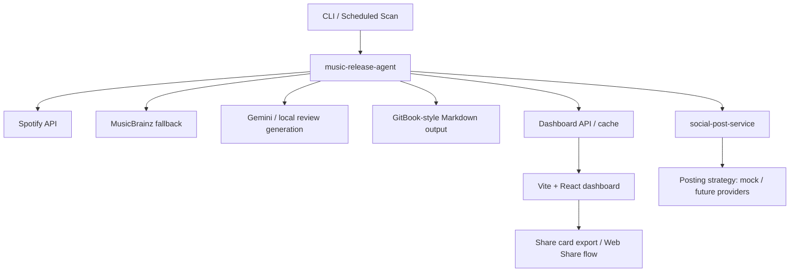

# music-release-agent

> A music release scanning and AI review system built around Spotify discovery, GitOps publishing, and a companion social posting microservice.

`music-release-agent` scans followed artists, generates AI-assisted album / song commentary, publishes Markdown output through a GitBook-style GitOps flow, and exposes a dashboard for browsing releases, translations, and share assets.

This repo is strongest when understood as the **read-heavy core service** of a two-service system:

- `music-release-agent`: discovery, review generation, dashboard, publishing
- `social-post-service`: async multi-platform posting and posting strategies

---

## 30-Second Pitch

This project automates a full music-content workflow:

1. discover new releases from Spotify
2. fall back to MusicBrainz when rate-limited
3. generate AI-assisted reviews / lyric commentary
4. publish Markdown output through GitOps
5. render a dashboard and social share assets
6. forward publishing jobs to a companion posting microservice

It is not just an API wrapper. The interesting parts are the system boundaries, fallback design, dry-run sandbox, and the way content generation is separated from outbound posting.

---

## Why It Is Worth Showing In Interview

- It is a **real pipeline**, not a single-page toy app.
- It has clear **service boundaries** between read-heavy and write-heavy responsibilities.
- It includes **rate-limit resilience** and fallback design.
- It has a **dry-run sandbox**, so an interviewer can validate the workflow without external credentials.
- It combines backend orchestration, frontend UX, testing, and publishing automation in one coherent system.

---

## System Shape



---

## 3-Minute Validation

You can validate the project without Spotify or Gemini credentials:

```bash
npm install
cd dashboard && npm install && cd ..
npm run scan:dry
npm start
cd dashboard && npm run dev -- --host
```

Then:

1. inspect `data/mock-gitbook/` output from the dry run
2. open `http://localhost:5173`
3. browse releases and AI lyric views
4. verify the share-card / posting flow in the dashboard

Full walkthrough: [DEMO_SCRIPT.md](./DEMO_SCRIPT.md)

---

## Companion Service

This repo assumes a companion microservice:

- `social-post-service`

Why split it out:

- release scanning and review generation are **read-heavy orchestration**
- social posting is **write-heavy, latency-prone, retry-prone integration work**

That split makes it easier to evolve posting strategies without bloating the core music pipeline.

---

## Reliability Notes

### Spotify rate-limit resilience

- parses `Retry-After`
- throttles requests
- falls back to MusicBrainz when Spotify is constrained

### Dry-run sandbox

- lets interviewers validate the system without API keys
- keeps the content and publishing pipeline demonstrable offline

### Test coverage

- includes Vitest-based tests for scanner flow, cache, circuit breaker, API client, and strategy behavior

---

## Quick Start

### Real Spotify / Gemini flow

```bash
npm install
cp .env.example .env
npm start
```

Then visit:

- `http://localhost:3011/login/spotify`

and run:

```bash
npm run scan
```

Environment template: [.env.example](./.env.example)

---

## Interview / Portfolio Docs

- [DEMO_SCRIPT.md](./DEMO_SCRIPT.md): 3-minute demo flow
- [INTERVIEW_GUIDE.md](./INTERVIEW_GUIDE.md): 60-second pitch and common questions
- [PORTFOLIO_SUMMARY.md](./PORTFOLIO_SUMMARY.md): resume bullets, short blurb, PR summary
- [DEVELOPER.md](./DEVELOPER.md): technical deep dive
- [PM2_DAEMON_GUIDE.md](./PM2_DAEMON_GUIDE.md): runtime and process management notes

---

## Repo Signals

- dry-run validation path
- dashboard + backend split
- rate-limit fallback design
- tested service / strategy layer
- companion posting microservice boundary
