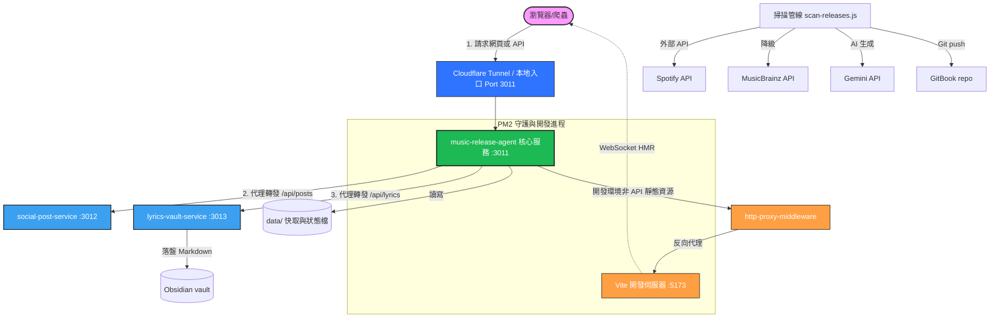

# 系統架構（System Architecture & Port Mapping）

本文件說明 `music-release-agent` 的系統架構、服務邊界、開發環境雙埠（5173/3011）反向代理機制與 HMR 運作原理。

---

## 1. 系統總覽與模組劃分

本專案由一個前端、一個後端核心服務與兩個 Companion 服務組成，架構圖如下：



各模組的職責劃分遵循單一職責原則（Single Responsibility Principle）：

| 元件 | 職責 | 不負責 |
|---|---|---|
| `music-release-agent`（核心服務） | 專輯元資料處理、掃描管線控制、AI 樂評、GitBook 輸出、對 Companion 服務的反向代理 | 實際對社群平台發佈貼文、歌詞翻譯與落盤 |
| `social-post-service`（Companion） | 接收社群發文任務、入隊、依策略（Mock / Ayrshare）非同步發佈至 Threads/X | 音樂庫資料處理、內容生成 |
| `lyrics-vault-service`（Companion） | 抓取 LRC 動態歌詞（LRCLIB）、呼叫 LLM 翻譯（Gemini/Ollama）、Obsidian 相容 Markdown 落盤 | 音樂發佈流程與元資料快取 |
| `dashboard`（React + Vite） | 專輯/單曲瀏覽介面、動態/全文歌詞播放同步、發文動作觸發 | 核心業務邏輯與狀態持久化 |

---

## 2. 開發環境與雙埠機制（為什麼分成 3011 與 5173 ？）

在本地開發此專案時，會同時運行前端（Vite, Port 5173）與後端（Express, Port 3011）兩個伺服器。以下為前後端分離下的技術原理解析：

### 2.1 統一入口點（Single Point of Entry）與反向代理
在生產環境中，我們只需要將域名直接對準後端 **Port 3011**，這是因為 Express 會直接透過靜態資源目錄分發經過 `vite build` 壓縮的前端檔案。
但在本地開發環境 (`NODE_ENV=development`)，我們需要快速的熱更新 (HMR)，所以：
1. Express 核心服務會啟用 `http-proxy-middleware`，將所有非 API 與非爬蟲的靜態檔案與熱更新請求反向代理至 **Port 5173 (Vite Dev Server)**。
2. 此時 Vite 的 WebSocket (`ws: true`) 會穿透後端代理直接與瀏覽器相連，達成代碼即時修改、即時更新。
3. 這樣既解決了瀏覽器**同源政策 (Same-Origin Policy)** 導致的 CORS 跨域阻擋問題，也保留了靈活的開發體驗。

### 2.2 👶 小朋友解說法：餐廳與廚房的故事
> 想像一下，你開了一間**超酷的音樂餐廳**：
>
> 1. **服務生與精美菜單 (Port 5173 - React 前端)**
>    * **它是誰**：在餐廳門口迎賓、拿著漂亮菜單、親切為顧客服務的**服務生**。
>    * **工作內容**：負責把專輯封面排得很漂亮、做出亮麗的按鈕，當你點擊按鈕時，服務生會在本子上紀錄「客人想要匯出圖卡」。
>    * **為什麼是 5173**：這是服務生站的**迎賓櫃檯位置**。如果大家都擠在廚房點餐，餐廳就亂套了！
>
> 2. **躲在後面的大廚與食材庫 (Port 3011 - Express 後端)**
>    * **它是誰**：躲在餐廳後方，負責拿食材、生火、用魔法烤箱 (Gemini AI) 煮出美味料理的**主廚**。
>    * **工作內容**：客人點了「歌詞翻譯」時，主廚立刻去冰箱拿出 Spotify 資料，再用 Gemini 魔法烤箱把雙語翻譯煮出來交給服務生。
>    * **為什麼是 3011**：這是廚房的**烹飪工作台位置**。主廚需要安靜且安全的空間來放金鑰 (GEMINI_API_KEY)，不能隨便讓客人跑進來看。
>
> 3. **他們怎麼合作？**
>    當你在菜單 (5173) 上點了「尋找歌詞」時，服務生會立刻小跑步到廚房工作台 (3011) 說：「主廚！請幫我煮一份 Maroon 5 的歌詞翻譯！」主廚煮好後交給服務生，服務生再端到桌上呈現在你面前。

---

## 3. 服務邊界與交接格式（Handoff Contract）

核心服務 `music-release-agent` 不直接持有社群發佈和歌詞翻譯的實作邏輯，而是分別向兩個 Companion 服務發送代理請求，此通訊嚴格遵循交接合約 (Handoff Schema)。

### 3.1 核心服務 ➔ 社群發文服務
*   **路由節點**：Dashboard ➔ `POST /api/social/publish` (核心) ➔ `POST /api/posts` (Companion, Port 3012)
*   **交接 JSON 格式**：
    ```json
    {
      "image": "<Base64 或 null>",
      "caption": "貼文內容文案（必填）",
      "platforms": ["threads"]
    }
    ```
*   **處理結果**：交接成功返回 HTTP `202 Accepted`，並附帶 `id` 以便非同步狀態輪詢。

### 3.2 核心服務 ➔ 歌詞與 Obsidian 快取服務
*   **路由節點**：Dashboard ➔ `POST /api/lyrics` (核心) ➔ `POST /api/translate` (Companion, Port 3013)
*   **交接 JSON 格式**：
    ```json
    {
      "artistName": "主要藝人名稱",
      "trackName": "歌曲名稱",
      "albumName": "專輯名稱（可選）",
      "forceRefresh": false
    }
    ```
*   **處理結果**：返回 HTTP `200 OK`，並輸出包含時間碼 `[mm:ss.xx]` 的中英對照 Markdown 格式，以及 Obsidian 落盤路徑。

---

## 4. 降級與防禦性錯誤處理 (Graceful Degradation)

在 Companion 服務或第三方 API 不可用時，系統具備以下健壯的降級防衛措施，確保核心服務與測試不崩潰：

1. **健康與就緒探針 (Liveness & Readiness Probes)**：
   * `/healthz`：一律回傳 200 OK，代表服務本身還活著。
   * `/readyz`：動態檢查依賴服務狀態。當 `social-post-service` 或 `lyrics-vault-service` 斷線或未啟動時，`/readyz` 會回傳 HTTP 200 OK 但回應中會將狀態標記為 `"status": "degraded"`，而非引發 Promise 崩潰的 500 錯誤。
2. **Spotify API 呼叫降級**：
   * 當 Spotify API 觸發冷卻上限時，系統會自動降級改為呼叫 **MusicBrainz API** 獲取曲目列表，若兩者都失效，則會啟用 **Fallback 機制** 輸出 Mock 的預設曲目，保證前端功能永遠處於可用狀態。
3. **MIME 資源錯誤防範**：
   * 萬用路由 `app.get('*')` 會排除任何包含副檔名（除了 `.html`）的檔案請求（回傳 404），避免瀏覽器將 HTML 當作 JS/CSS 載入時觸發致命的 MIME 混淆報錯。
