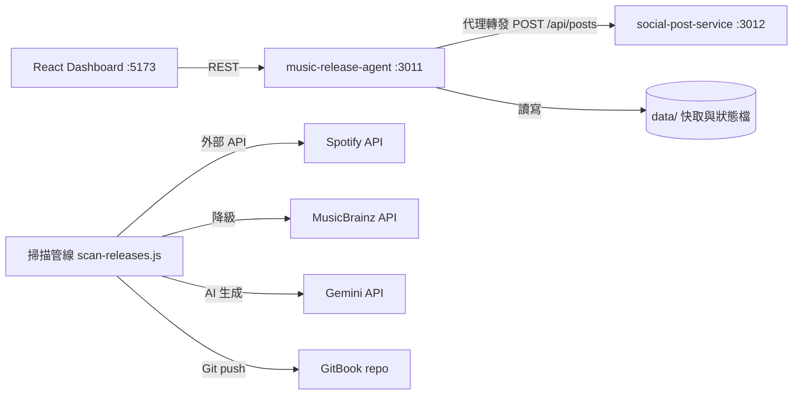

# 系統架構（Architecture）

本文件說明 `music-release-agent` 的資料流、服務邊界、跨服務交接格式（handoff format）與失敗模式。目標讀者是想在 15 分鐘內理解「資料怎麼流、邊界在哪、壞掉時會發生什麼事」的評估者。

---

## 1. 系統總覽

本專案由兩個服務與一個前端組成：



職責劃分遵循單一職責原則：

| 元件 | 職責 | 不負責 |
|---|---|---|
| `music-release-agent`（核心服務） | 音樂庫 API、掃描管線、AI 樂評、GitBook 輸出、社群發文「代理」 | 實際對社群平台發文 |
| `social-post-service`（companion） | 接收發文任務、入隊、依策略（Mock / Ayrshare）非同步發佈 | 音樂資料與內容生成 |
| `dashboard`（React + Vite） | 瀏覽、歌詞翻譯展示、觸發發佈 | 任何商業邏輯與狀態持久化 |

---

## 2. 資料流（Data Flow）

### 2.1 掃描 → 樂評 → 發佈管線

真實模式（`npm run scan`）與離線模式（`npm run scan:dry`）走同一條邏輯管線，差別只在資料來源與副作用：

```
[資料來源] → [掃描] → [樂評生成] → [寫入 GitBook 結構] → [SUMMARY.md 更新] → [Git push]

真實模式:  Spotify API     Gemini API      GITBOOK_PATH          真實 commit/push
離線模式:  mock-releases.json  確定性模板    data/mock-gitbook/    模擬輸出（log only）
```

離線模式的關鍵檔案：

- 輸入 fixture：`data/mock-releases.json`（schema 見下節）
- 共用核心：`src/dry-run/pipeline-core.js` — slug 規則、樂評模板、schema 驗證的單一事實來源，被 `scan-releases-dry.js`、`scripts/demo-verify.js` 與 golden tests 三方共用，避免規則漂移
- 產物：`data/mock-gitbook/new-releases/<slug>.md` + `SUMMARY.md`

### 2.2 release 資料格式（管線輸入 schema）

`data/mock-releases.json` 中每筆 release 必須通過 `validateReleases()`：

```json
{
  "id": "Spotify ID（非空字串，slug 退化時的檔名後備）",
  "name": "發行名稱（非空字串）",
  "primary_artist": "主要藝人（非空字串）",
  "type": "album 或 single",
  "total_tracks": "正整數",
  "release_date": "YYYY-MM-DD",
  "url": "http(s) 連結",
  "image": "封面圖 URL",
  "artist_genres": "字串陣列（可為空，空時樂評使用後備流派文字）"
}
```

違反 schema 的資料會讓管線以非零 exit code 失敗，錯誤訊息包含「第幾筆、哪個欄位、規則是什麼」。

### 2.3 檔名 slug 規則

`releaseSlug(release)` = `generateSlug("{artist}-{name}")`，規則：轉小寫、空白轉連字號、移除非 `\w`/連字號/中日韓字元、合併連續連字號。邊界情況：名稱全為符號時 slug 會退化（如 `"!!!-???"` → `"-"`），此時退回使用 `release.id`，避免產生 `-.md` 這類無效檔名。此行為由 golden tests 鎖定。

---

## 3. 服務邊界與交接格式（Handoff Format）

### 3.1 核心服務 → 發文服務

Dashboard 不直接呼叫 `social-post-service`；一律經由核心服務代理。這讓前端只需要一個 origin，也讓核心服務統一處理逾時、錯誤轉譯與 request id 傳遞（`x-request-id` correlation header）。

**發文請求**（Dashboard → 核心 `POST /api/social/publish` → companion `POST /api/posts`）：

```json
{
  "image": "<base64 或 null>",
  "caption": "發文文案（必填，缺少時核心服務直接回 400，不轉發）",
  "platforms": ["threads"]
}
```

**接受回應**（companion → 核心 → Dashboard，HTTP 202）：

```json
{ "jobId": "<uuid>", "status": "queued" }
```

**狀態輪詢**（`GET /api/social/status/:jobId` → companion `GET /api/posts/:jobId`）：

```json
{
  "jobId": "<uuid>",
  "status": "queued | completed | failed",
  "results": [
    { "platform": "threads", "success": true, "postedAt": "<ISO 8601>" }
  ]
}
```

此契約有兩份可執行的證明：

1. `npm run demo:verify:social` — 若姊妹 repo `../social-post-service` 存在則用真實服務；不存在時自動退回 `tests/fixtures/mock-social-service.js`（零依賴、實作同一契約的內建 mock），所以本 repo 單獨 clone 也能驗證 handoff
2. `npm run demo:verify:social:down` — 驗證 companion 不可達時的降級行為

### 3.2 掃描器 → 外部資料源（策略邊界）

`src/strategies/` 實作 discovery strategy 介面，掃描器只依賴抽象：

- `spotify-strategy.js` — 主要渠道
- `musicbrainz-strategy.js` — 降級渠道，輸出動態轉換為 Spotify 相容 schema

### 3.3 後端 → 前端（內容信任邊界）

AI 生成的歌詞與分析以 Markdown 字串交付前端。前端視其為**不可信輸入**：`dashboard/src/utils/markdown.js` 先對整行做 HTML 轉義，再做格式解析，輸出僅含白名單標籤（h2/h3/hr/div/span/p/strong/br）。此邊界由 `tests/markdown-renderer.test.js` 以惡意 payload 鎖定。

---

## 4. 失敗模式（Failure Modes）

| 失敗情境 | 系統行為 | 可執行證明 |
|---|---|---|
| Spotify 回 429 限流 | 解析 `Retry-After` 智慧休眠；24 小時內達 2 次 → 熔斷禁用 Spotify 24 小時 | `tests/circuit-breaker.test.js`、`tests/baseline.test.js` |
| Spotify 被熔斷或連線失敗 | 自動降級 MusicBrainz（搜 MBID → 抓專輯 → 轉換 schema） | `tests/baseline.test.js`、`tests/strategies.test.js` |
| MusicBrainz 也失敗 | 回傳 mock 預設曲目（最後防線），不讓管線崩潰 | `tests/baseline.test.js` |
| `social-post-service` 不可達 | `/api/social/health` 回 `reachable: false`；`/api/social/publish` 回穩定 502（不 hang、不 crash）；`/readyz` 回 `degraded` | `npm run demo:verify:social:down` |
| mock fixture 資料壞掉 | 管線非零 exit code + 列出每個壞欄位；`demo:verify` 在執行管線「之前」就擋下 | `tests/golden/dry-run-golden.test.js`（失敗情境） |
| 生成的樂評內容不完整 | `demo:verify` 檢查封面圖、標題、評分、聆聽連結四個必要標記，缺一即 fail | `npm run demo:verify` |
| SUMMARY.md 重複連結（冪等性破壞） | `demo:verify` 偵測同一連結出現超過一次即 fail | golden tests 冪等性案例 + `demo:verify` |
| AI 回傳的歌詞/分析含惡意 HTML | 前端 Markdown 轉譯器先轉義再解析，輸出僅含白名單標籤，注入內容以純文字呈現 | `tests/markdown-renderer.test.js` |

### Readiness 語意

`/readyz` 刻意不把「依賴掛了」壓縮成二元 up/down：

- `ok` — 核心 ready 且 companion 可達
- `degraded` — 核心 ready，companion 不可達（核心讀取功能照常服務）
- `not_ready` — 核心靜態資產或必要 mock data 不完整（回 503）

---

## 5. 驗證層次（Proof Ladder）

由淺入深，每一層都是一個命令：

| 層次 | 命令 | 需要網路/憑證 | 驗證什麼 |
|---|---|---|---|
| 1 | `npm test` | 否 | 全部單元 + golden + 前端安全測試（含正常/模糊/失敗情境） |
| 2 | `npm run demo:verify` | 否 | 離線管線端到端 + 產物 schema 與內容完整性 |
| 3 | `npm run demo:verify:social` | 否（自動退回內建 mock） | 跨服務 handoff 契約 |
| 4 | `npm run demo:verify:social:down` | 否 | 依賴失敗時的降級行為 |
| 5 | `npm run scan` | 是（Spotify + Gemini 憑證） | 真實管線 |

測試提示：golden e2e 測試透過 `DRY_RUN_FAST=1`、`DRY_RUN_DATA_PATH`、`DRY_RUN_OUTPUT_DIR` 環境變數把管線導向暫存目錄執行，輸出內容與正式 dry-run 完全相同，只是跳過模擬延遲。

CI（`.github/workflows/ci.yml`）在每次 push 時執行第 1–4 層：單元測試、`demo:verify`、`demo:verify:social`（內建 mock）、`demo:verify:social:down`，再加上 dashboard build、Playwright e2e 與兩個 Docker image build。第 5 層需要真實憑證，刻意不放入 CI。
