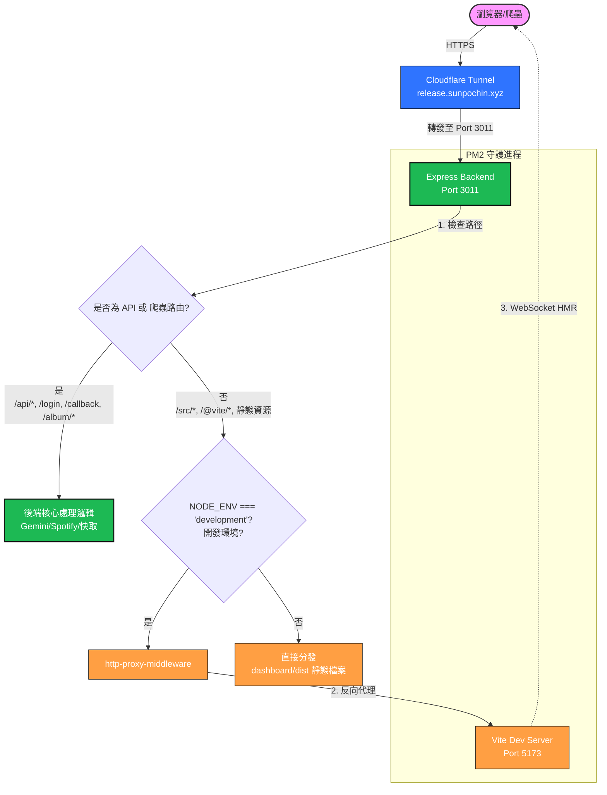

# 🛠️ 開發環境代理與 HMR 熱更新架構說明

在本地開發此專案時，為了解決前端單頁應用（SPA）與後端 API 路由同源（Same-Origin）的問題，並同時保有 Vite 的 **即時熱更新 (HMR)** 與 **SEO 爬蟲 OG Meta 預覽** 能力，本專案採用了雙埠代理架構。

---

## 視覺化架構流程圖 (Mermaid Diagram)

---

## 核心設計理念與優勢

### 1. 統一入口點（Single Point of Entry）
Cloudflare 不需要分別設定多個子網域（如 `api.sunpochin.xyz` 與 `release.sunpochin.xyz`），只需統一將 `release.sunpochin.xyz` 轉發至本地的 **Port 3011**（Express 後端）。

### 2. 開發與生產無縫切換
*   **開發環境 (`NODE_ENV=development`)**：
    後端會啟用 `http-proxy-middleware`，將所有非 API 與非爬蟲的靜態資源請求透明地反向代理至 **Port 5173** 的 Vite 服務。此時 Vite 的 WebSocket (`ws: true`) 會穿透後端代理，與瀏覽器建立 HMR 連線，達成即時修改、即時更新的極致流暢開發感。
*   **生產環境 (`NODE_ENV=production`)**：
    後端不再代理，改為直接使用 `express.static` 分發前端經過 `vite build` 壓縮優化後的 `dashboard/dist` 靜態資源，此時 **不需要開啟 Port 5173**，節省伺服器記憶體。

### 3. SEO 爬蟲友好（OG Metadata Pre-rendering）
當 Facebook 或 LINE 爬蟲請求 `/album/123/song/456` 時，Express 會在 **3011** 優先攔截並回傳完整的 HTML 與 Meta Tags（而不是回傳空的 SPA 首頁），保證在通訊軟體上的卡片預覽完美呈現。

---

## 👶 小朋友解釋法：為什麼會發生「雙重 React 衝突」？

### 故事背景
想像一下，我們開了一家叫 **「音樂釋出特工 (Music Release Agent)」** 的餐廳。
廚房裡有一位叫 **React** 的大廚，他有一本專門記點單和狀態的 **「神奇小筆記本 (useState/Hooks)」**。

### 發生了什麼事？
因為餐廳的門牌指引有點複雜（後端 3011 代理轉發到前端 5173，而且有兩層不同的 node_modules 資料夾），服務生們搞混了：
- **服務生 A (App.jsx)** 跑去跟 **React 廚師 1 號** 點了一份「歌曲清單」。
- **服務生 B (useAlbumTracks.js)** 卻跑去問 **React 廚師 2 號**：「剛剛點的歌曲清單好了嗎？」
- **React 廚師 2 號** 翻開自己的神奇小筆記本，一臉困惑地說：「我的筆記本是空的啊！根本沒有這筆點單！(TypeError: Cannot read properties of null (reading 'useState'))」

結果，服務生們在廚房撞成一團，盤子全摔碎了（網頁直接白屏報錯）。

### 我們是怎麼治好它的？
我們去找餐廳總經理（`vite.config.js`），在佈告欄上寫下一條鐵律：
> 🚫 **「廚房裡只能有唯一的一位 React 大廚！不准有任何分身複製人！所有服務生如果要找 React 廚師，必須統一走到 `dashboard/node_modules/react` 這間辦公室，不准走錯！」** (resolve.alias & resolve.dedupe)

現在，所有人都只會找同一位大廚，神奇小筆記本永遠能對得起來，餐廳就能順暢出菜囉！

---

## ❄️ 續集故事：為什麼有時大廚會說「找不到食材」？

### 故事背景
在我們的餐廳裡，顧客點歌時，服務生上菜有三種方式：
1. **🚚 冷凍微波包 (已翻譯快取 `.gemini.v2.md`)**：以前做過且翻譯好的雙語大餐，直接微波 10ms 上菜！
2. **📦 新鮮生食材 (原始歌詞快取 `.raw.v0.md`)**：有歌詞原文，點一下翻譯就能現做。
3. **🏃 跑去超級市場 (Spotify / LRCLIB)**：廚房裡什麼都沒有，服務生只好跑出門去買。

### 剛剛發生了什麼意外？
當顧客點了《Apocalipsis (versión salsa)》這首歌時，廚房發生了以下狀況：

*   **雲端傳送門堵塞了 (iCloud 同步延遲)**：
    我們剛剛把餐廳搬到了新地址（移到 iCloud 雲端資料夾）。雖然我們用卡車把以前做好的「冷凍微波包」載過去了，但新廚房的冷凍庫連接著一個**「魔法雲端傳送門 (iCloud Sync)」**。
    當下這個傳送門慢了半拍，冷凍微波包還卡在傳送通道裡，還沒有在冷凍庫裡「現形」！
*   **沒有生食材、超市也買不到**：
    服務生在廚房裡找不到生食材（沒有 `.raw.v0.md`）。他急忙跑去超級市場買，但外面這家超市沒有進這款特別版歌曲（LRCLIB 上沒有），而我們又沒有買超市的 VIP Pass (未設定 `sp_dc` cookie)。
*   **無奈的公告**：
    服務生只好尷尬地跟顧客說：*「抱歉！我們找不到食材，請點擊標題旁的 AI 翻譯按鈕，讓 AI 大廚用大腦記憶來幫您做菜吧！」*

### 結局
幾分鐘後，**魔法雲端傳送門終於同步完成了！** 冷凍微波包成功現形在冷凍庫裡。現在您只要重新走進餐廳，大廚就能立刻把做好的美味雙語歌詞微波上桌囉！

