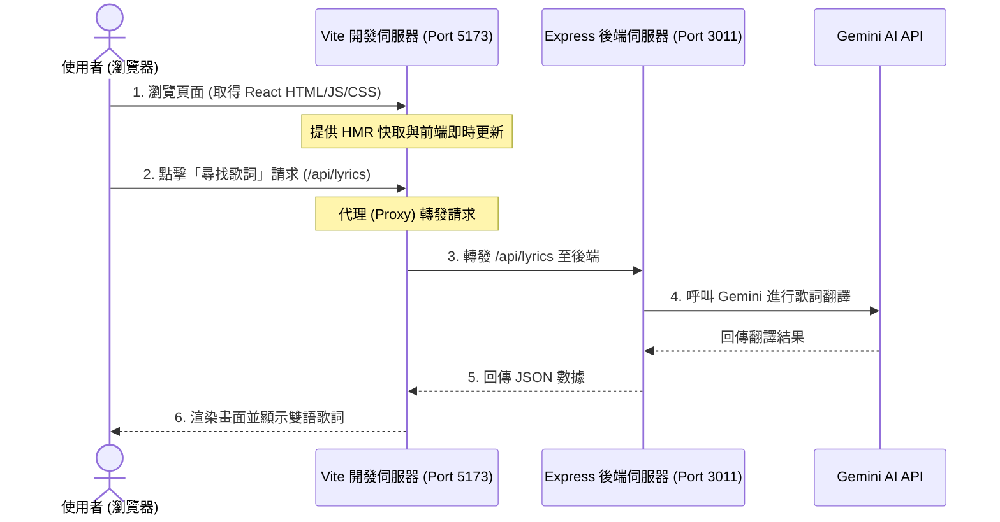

# 為什麼 Localhost 會分成 3011 與 5173 兩個連接埠 (Port)？

在開發我們的 **Music Release Agent Dashboard** 時，你會發現瀏覽器打開的是 `http://localhost:5173`，但後端伺服器又說它運行在 `http://localhost:3011`。以下用兩種方式為你徹底解密！

---

## 🧒 小朋友解說法：餐廳與廚房的故事

想像一下，你開了一間**超酷的音樂餐廳**：

### 1. 服務生與精美菜單 (Port 5173 - React 前端)
* **它是誰**：在餐廳門口迎賓、拿著漂亮菜單、親切為顧客服務的**服務生**。
* **工作內容**：負責把專輯封面排得很漂亮、做出亮麗的按鈕，當你點擊按鈕時，服務生會在本子上紀錄「客人想要匯出圖卡」。
* **為什麼是 5173**：這是服務生站的**迎賓櫃檯位置**。如果大家都擠在廚房點餐，餐廳就亂套了！

### 2. 躲在後面的大廚與食材庫 (Port 3011 - Express 後端)
* **它是誰**：躲在餐廳後方，負責拿食材、生火、用魔法烤箱 (Gemini AI) 煮出美味料理的**主廚**。
* **工作內容**：客人點了「歌詞翻譯」時，主廚立刻去冰箱拿出 Spotify 資料，再用 Gemini 魔法烤箱把雙語翻譯煮出來交給服務生。
* **為什麼是 3011**：這是廚房的**烹飪工作台位置**。主廚需要安靜且安全的空間來放金鑰 (GEMINI_API_KEY)，不能隨便讓客人跑進來看。

### 3. 他們怎麼合作？
當你在菜單 (5173) 上點了「尋找歌詞」時，服務生會立刻小跑步到廚房工作台 (3011) 說：「主廚！請幫我煮一份 Maroon 5 的歌詞翻譯！」
主廚煮好後交給服務生，服務生再端到桌上呈現在你面前。這就是為什麼他們需要有各自的位置（Port），但又能互相合作！

---

## 💻 工程師技術原理解析

在現代網頁開發（特別是單頁應用 SPA 如 React/Vue）中，我們通常會採取**前後端分離**的架構：



### 1. 前端開發伺服器 (Vite Dev Server - Port 5173)
* **定位**：靜態資源編譯與熱更新 (Hot Module Replacement, HMR) 伺服器。
* **技術細節**：Vite 負責即時監聽你的 React 程式碼（如 `App.jsx`）。當你修改一行 CSS 或 JSX 時，它能在**毫秒等級**內只更新瀏覽器的該部分畫面，而不需要重新整理整張網頁。
* **特點**：它只負責傳送 HTML, JavaScript, CSS 檔案給你的瀏覽器，**不具備**存取資料庫或呼叫第三方 API（如 Gemini）的後端能力。

### 2. 後端 API 伺服器 (Express Server - Port 3011)
* **定位**：業務邏輯與 API 服務器。
* **技術細節**：負責讀取本地的快取 JSON 檔案、安全地呼叫 Gemini API（這需要用到伺服器端的 `process.env.GEMINI_API_KEY`，該密鑰絕對不能暴露給前端瀏覽器，否則會被盜用），並提供 RESTful APIs 節點。
* **特點**：它不關心畫面長什麼樣子，只負責處理數據並回傳 JSON 格式的資料。

### 3. 開發期間的橋樑：Vite 代理機制 (Proxy)
由於瀏覽器的**同源政策 (Same-Origin Policy)**，運行在 `5173` 的前端直接向 `3011` 發送請求會觸發 CORS 跨域阻擋。
我們在 `vite.config.js` 中配置了代理：
```javascript
// 位於 vite.config.js 中的代理設定
server: {
  proxy: {
    '/api': {
      target: 'http://localhost:3011',
      changeOrigin: true
    }
  }
}
```
這代表：當前端發送請求給 `/api/albums` 時，Vite 伺服器會自動在幕後假裝是同一個網站，幫你轉發給 `3011` 的 Express 伺服器取得資料後再轉交回 React，完美避開了跨域限制，也簡化了開發時的設定！

### 4. 生產環境 (Production) 的改變
當專案要上線時，我們會執行 `npm run build`，將前端 React 程式碼打包壓縮成純靜態的 `dist` 資料夾。
接著，Express 後端伺服器 (3011) 會透過這行程式碼：
```javascript
app.use(express.static(path.join(process.cwd(), 'dashboard/dist')));
```
直接接管並提供前端的所有檔案。因此**上線後就不再需要 5173**，使用者只要輸入 `http://localhost:3011` 就能同時看到精美畫面與呼叫 API！
